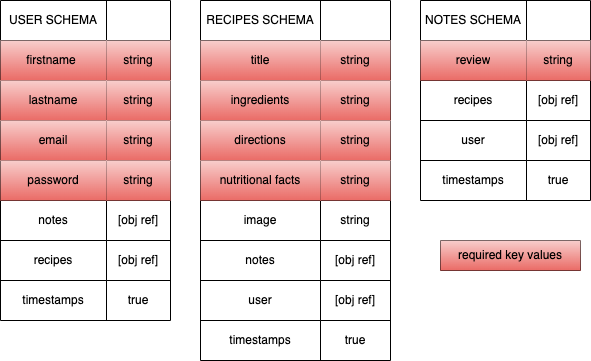

# P3 PITCH
- I would like to build vegan recipes app for people who chooses vegan life style to have exclusive part in this community so they can create, edit and experiment new recipes and search for other users recipes and leave reviews/notes under each recipe as they like.

# User Stories
- As a user I would like to; 
- register to create an account and able to delete my accout.
- login and logout of my account.
- create, delete my vegan recipes in my profile.
- have a home page that would display all recipes.
- have a profile page where I could edit my name.
- see a each recipe, pictures, descriptions.
- able to write reviews and edit them for each recipe.

# Tech stach:
- Javascript
- CSS/Bootstrap
- React.js
- express
- MongoDB
- Mongoose

# Requirements:
MongoDB
NPM
Vegan-Recipes-Server

# ERDs 

# Wireframes

# MVP goals
- creating a Mern app using ReactJS ca nbe usable by many users;
- can create recipes, make comments and edit all.
- can display the recipes and make reviews.
- edit or delete profile.

# Authentication
| VERB   | URI Path                    | CRUD            | Description                             |
| :----: | :-------------------------: | :-------------: | :-------------------------------------: |
| POST   | `/register`                 | Create          | sign up/ user registeration             |
| GET    | `/profile`                  | Read            | displays user profile page              |
| POST   | `/login`                    | Read            | login /find user                        |
| PUT    | `/profile/:id`              | Update          | updates user password                   |
| DELETE | `/profile/:id`              | Destroy         | deletes profile                         |

# Routes
| VERB   | URL Path                    | CRUD           | Description                              |
| :----: | :-------------------------: | :------------: | :--------------------------------------: |
| GET    | `/`                         | Read           | Home | Layout                            |
| GET    | `/recipes`                  | Read           | displays recipes                         |
| GET    | `/recipes/:id`              | Show           | display the specific recipe              |
| POST   | `/recipes`                  | Create         | create a new recipe                      |
| PUT    | `/recipes/:id`              | Update         | update the recipe created by user        |
| DELETE | `/recipes/:id`              | Destroy        | removes the recipe user created          |
| POST   | `/:recipesId/notes`         | Create         | add review or a note to specific recipe  |

# strech goals
- editing comments 
- deleting comments
- display other user recipes
- able to add comments on other user recipes and delete
